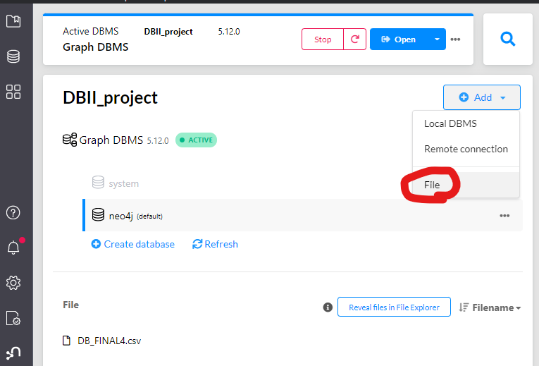
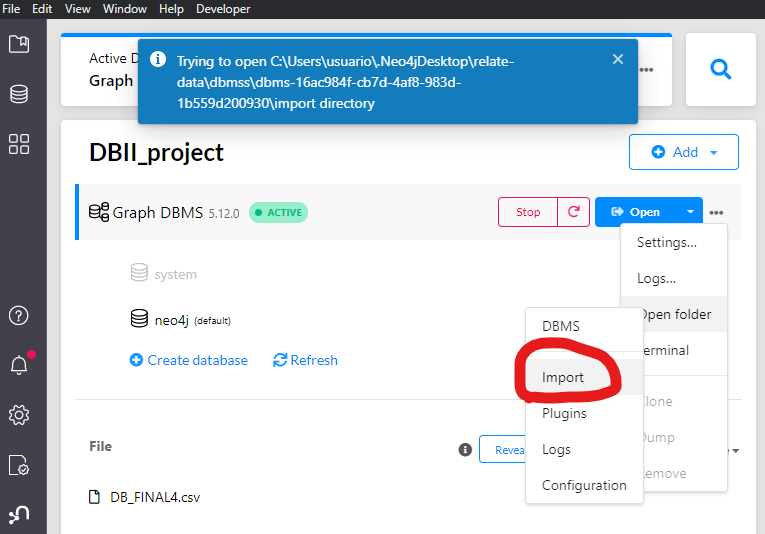

## Agregar el archivo csv

click a este botton


## Importar el csv a la base de datos

Este botón permite importar  archivos a la dirección que te indica

copia la ruta, abrelo en tu administrador de archivos (file manager) y pon una copia del archivo csv.

## Cómo poner ajustar los datos y relaciones.

Copia y pega todos los queries en el archivo [cargar3.txt](cargar3.txt)

Con esto debería estar tu base de datos con los datos de la aplicación.

## Graph of Data scheme with APOC plugin
Instala el plugin APOC desde la interfaz de neo4j, usa el siguiente comando para generar un gráfo del data scheme.
```txt
CALL apoc.meta.graph()
```


## Data scheme


